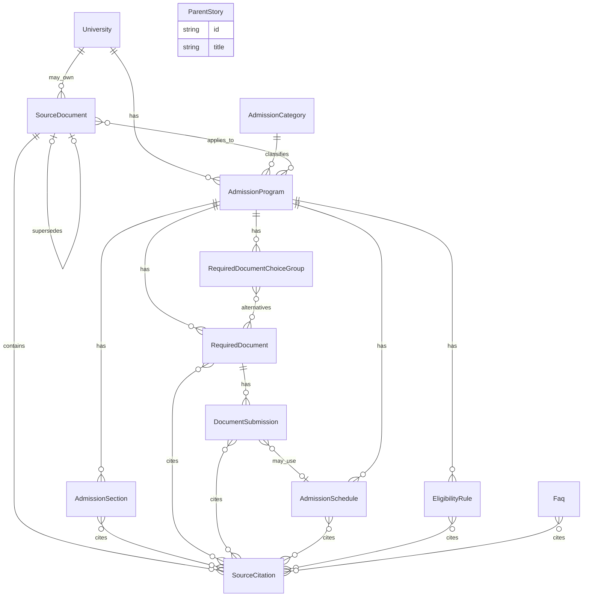

# DATA_MODEL

이 문서는 3teuk-Consulting MVP의 conceptual / logical data model을 정의한다.

목적은 다음 질문에 답하는 것이다.

"대학 입시정보를 어떤 구조로 저장해야
학년도 관리, 출처 검증, 대학비교, 자격진단을
안전하게 지원할 수 있는가"

이번 단계에서는 논리 모델만 정의한다.
실제 PostgreSQL SQL, Supabase schema, Prisma, migration,
database instance는 생성하지 않는다.

이 문서는 `AGENTS.md`, `docs/MVP_SPEC.md`,
`docs/SITE_MAP.md`, `docs/WIREFRAME.md`의 요구사항을 충족하도록 작성한다.

KU + Yonsei 2027 schema validation 이후
`docs/DB_SCHEMA_DRAFT.md`에서 확정된 conceptual 변화를
이 문서에 동기화한다.

DATA_MODEL.md는 conceptual source of truth다.
DB_SCHEMA_DRAFT.md는 그 conceptual model을
PostgreSQL 구현 관점에서 구체화한 logical schema다.

두 문서는 핵심 entity와 relation 관점에서
동일한 방향을 가진다.

UUID default function, CHECK syntax, trigger, index,
exact FK action 같은 구현 세부는
DB_SCHEMA_DRAFT / SQL 단계에서 다룬다.

실제 대학 입시정보, 실제 모집요강, 실제 eligibility rule,
실제 source URL은 작성하지 않는다.

# 1. 문서 목적

DATA_MODEL은 구현 전에 다음을 확정하기 위한 기준 문서다.

- 어떤 entity가 필요한가
- entity 사이에 어떤 관계가 있는가
- 학년도, 출처, 검증일을 어디에 두는가
- 대학비교와 자격진단이 어떤 데이터를 읽는가
- 무엇을 저장하고 무엇을 저장하지 않는가

실제 table DDL은 아직 작성하지 않는다.

검증 근거:

- `docs/DATA_MODEL_VALIDATION_2027.md`
- `docs/DB_SCHEMA_VALIDATION_KU_2027.md`
- `docs/DB_SCHEMA_VALIDATION_YONSEI_2027.md`
- `docs/DB_SCHEMA_DRAFT.md`

이번 문서는 그 validation 이후
post-validation conceptual refinement를 반영한다.

# 2. 핵심 설계 원칙

## 2.1 학년도 독립성

2026학년도와 2027학년도 전형은
같은 대학·유사한 전형명이어도
독립적인 AdmissionProgram 데이터로 취급한다.

이전 학년도의 정보를
새 학년도로 자동 복사하거나 유효하다고 가정하지 않는다.

서로 다른 academic_year의 데이터를
하나의 동일 조건 비교표에 혼합하지 않는다.

## 2.2 Source of Truth

AdmissionProgram 및 그 하위 데이터가
대학비교와 자격진단에서 사용하는 source of truth다.

대학비교 전용 데이터 복제본을 만들지 않는다.

자격진단의 대학별 자격 확인도
동일한 AdmissionProgram, AdmissionSection, EligibilityRule을 사용한다.

## 2.3 Source Traceability

official_fact는
가능하면 최소 하나 이상의 공식 source citation과 연결되어야 한다.

단순 source URL 하나만 저장하는 구조로 제한하지 않는다.

공식 문서 자체(SourceDocument)와
그 문서 안의 page/section reference(SourceCitation)를 구분한다.

## 2.4 Verification과 Update 구분

updated_at과 verified_at을 같은 의미로 취급하지 않는다.

updated_at:
데이터 레코드가 기술적으로 수정된 시점.

verified_at:
공식 자료와 대조하여 내용이 검증된 시점.

전형 전체 verification과
개별 section verification도 구분 가능하도록 한다.

## 2.5 Campus identity와 event venue 구분

University.campus_name
= 입학전형을 운영하는 campus identity

AdmissionSchedule.location_text
= 면접/시험/서류제출 등의 실제 event venue

둘은 같은 개념이 아니다.

## 2.6 Logical document와 submission event 구분

RequiredDocument
= 무엇을 제출해야 하는가

DocumentSubmission
= 언제 / 어떻게 / 어떤 형태로 제출하는가

한 logical document를
제출 단계 때문에 복제하지 않는다.

# 3. Entity 개요

기본 모델은 다음 entity로 구성한다.

1. University
2. AdmissionCategory
3. AdmissionProgram
4. AdmissionSection
5. RequiredDocument
6. DocumentSubmission
7. RequiredDocumentChoiceGroup
8. AdmissionSchedule
9. SourceDocument
10. SourceCitation
11. EligibilityRule
12. Faq
13. ParentStory

RequiredDocumentChoiceGroup은
KU + Yonsei 양쪽에서 alternative document pattern이 반복되어
initial core conceptual structure로 승격되었다.

ChoiceGroupItem은
RequiredDocumentChoiceGroup과 RequiredDocument를 잇는
join relation이다.
독립 핵심 entity 번호로 올리지 않는다.

join relation 개요:

- University 1 → N AdmissionProgram
- AdmissionCategory 1 → N AdmissionProgram
- AdmissionProgram 1 → N AdmissionSection
- AdmissionProgram 1 → N RequiredDocument
- RequiredDocument 1 → N DocumentSubmission
- DocumentSubmission N → 0..1 AdmissionSchedule
- AdmissionProgram 1 → N AdmissionSchedule
- AdmissionProgram 1 → N RequiredDocumentChoiceGroup
- RequiredDocumentChoiceGroup N ↔ N RequiredDocument
- AdmissionProgram 1 → N EligibilityRule
- University 1 → N SourceDocument (nullable)
- AdmissionProgram N ↔ N SourceDocument
- SourceDocument 1 → N SourceCitation
- core citation targets N ↔ N SourceCitation
  (AdmissionSection, RequiredDocument,
  DocumentSubmission, AdmissionSchedule)
- 향후 citation targets: EligibilityRule, Faq

ParentStory는 공식 admission facts와 별도의 content 영역이다.

DiagnosisSession은 MVP에서 필수 persistent entity로 포함하지 않는다.

AdmissionTrack은 이번 MVP의 필수 entity가 아니다.
향후 확장 포인트로만 기록한다.

Campus entity, structured applicability model,
structured document subject lookup,
evaluation child tables, source conflict entity,
source URL alias model도 현재 core가 아니다.

# 4. University

역할:

MVP에서는 University를
대한민국 대학명 자체만이 아니라
입학전형을 정확히 귀속시킬 수 있는
대학/캠퍼스 단위로 사용한다.

필드 초안:

- id
- name_ko
- name_en (nullable)
- campus_name (nullable)
- display_name
- slug
- official_website_url
- admissions_office_url
- created_at
- updated_at

이름 구분:

name_ko
= 대학의 기본 공식 명칭

campus_name
= 입학전형 및 공식 입학처를 구분하기 위해
  캠퍼스 구분이 필요한 경우 사용

display_name
= 사이트 UI에서 대학/캠퍼스를
  사용자가 혼동하지 않도록 표시하는 이름

display_name은 공식 의미를 바꾸거나
새로운 대학을 만들어내는 용도로 사용하지 않는다.

원칙:

대학 자체 정보와
특정 학년도의 전형 정보를 섞지 않는다.

University.admissions_office_url은
개별 모집요강 SourceDocument URL과 다른 개념이다.

입학처 홈페이지는 대학의 공식 창구이고,
모집요강 PDF/공지 URL은 특정 학년도 자료다.

서로 다른 입학처 또는 모집요강을 운영하는 캠퍼스를
동일한 University record로 무조건 합치지 않는다.

AdmissionProgram이
잘못된 캠퍼스의 SourceDocument와 연결되는 것을
방지할 수 있어야 한다.

campus 식별은 단순 UI 표시 문제가 아니라
다른 모집요강, 지원자격, 일정, source를 연결하는
데이터 정확성 문제다.

University.campus_name은
입학전형을 운영하는 campus identity다.

AdmissionSchedule.location_text는
면접/시험/서류제출 등의 실제 event venue다.

둘은 같은 개념이 아니다.
campus identity를 venue로 쓰지 않고,
venue를 campus identity로 쓰지 않는다.

## University identity

slug나 display_name을 영구 identity로 사용하지 않는다.

향후 DB에서는 immutable primary key를 사용한다.

캠퍼스 구분이 필요한 경우
name_ko + campus_name과 같은 조합은
사람이 이해하는 uniqueness 판단에 활용할 수 있다.

이를 실제 PK로 사용한다고 확정하지 않는다.

initial schema에서
name_ko + campus_name composite uniqueness를
DB constraint로 두지 않는 방향은
DB_SCHEMA_DRAFT를 따른다.
구현 세부는 schema/SQL 단계에서 다룬다.

## MVP campus 표현

이번 MVP에서는 별도 Campus entity를
필수로 도입하지 않는다.

이유:

- 초기 구조를 단순하게 유지한다.
- 2027학년도 연세대학교 서울캠퍼스와
  고려대학교 서울캠퍼스 검증에서는
  University record에 campus discriminator를 두는 방식으로
  정확한 source 귀속이 가능할 가능성이 높다.

이 결정은 모든 대학에 대한 영구 결론이 아니라
MVP의 초기 normalization 전략이다.

## 향후 확장 포인트: Campus

다음 상황이 반복되면 향후

University
1 → N Campus

구조를 검토한다.

- 여러 캠퍼스가 대학 공통 메타데이터를 대량 공유한다.
- 캠퍼스별 AdmissionProgram과 admissions office가 별도 운영된다.
- campus 정보를 여러 entity에서 반복 저장하게 된다.

이번 단계에서는 Campus entity를 확정하지 않는다.

# 5. AdmissionCategory

역할:

사이트 검색과 비교를 위한
내부 전형 분류 체계를 표현한다.

예상 필드:

- id
- code
- label_ko
- description
- active

중요:

AdmissionCategory는
대학이 사용하는 공식 전형명과 동일한 개념이 아니다.

사이트 내부 taxonomy임을 명확히 한다.

실제 category 값은
이번 문서에서 임의로 확정하지 않는다.

예: 대학이 쓰는 공식 명칭은
AdmissionProgram.official_program_name에 보존하고,
UI 표시명은 display_name에 둘 수 있으며,
검색용 묶음은 AdmissionCategory로 둔다.

AdmissionCategory는
official_program_name, display_name과 별도 개념이다.

# 6. AdmissionProgram

역할:

AdmissionProgram은
"하나의 모집요강 문서"를 의미하지 않는다.

AdmissionProgram =
지원자격, 평가방법, 제출서류, 대학비교,
대학별 자격진단을 독립적으로 적용할 수 있는
가장 작은 공식 전형 단위.

하나의 공식 모집요강 안에 서로 다른 지원자 유형이나
독립적으로 판단해야 하는 전형이 여러 개 있으면
각각 별도의 AdmissionProgram으로 표현할 수 있다.

대학비교의 기본 대상은 AdmissionProgram이다.
대학별 자격 확인의 기본 대상도 AdmissionProgram이다.
모집요강 문서 자체를
비교 또는 자격판정 단위로 사용하지 않는다.

필드 초안:

- id
- university_id
- admission_category_id (nullable)
- academic_year
- official_program_name
- display_name
- admission_slug
- information_type
- verification_status
- verified_at
- created_at
- updated_at
- notes

이름 구분:

official_program_name
= 대학 공식 자료의 명칭을 가능한 한 그대로 보존

display_name
= 사용자 UI에서 이해하기 쉽게 보여주기 위한 표시명

display_name은 공식 의미를 바꾸거나
새로운 전형을 만들어내는 용도로 사용하지 않는다.

AdmissionCategory는
사이트 내부 검색/taxonomy용이며
official_program_name, display_name과 별도 개념이다.

관계:

University 1 → N AdmissionProgram
SourceDocument N ↔ N AdmissionProgram

고유성:

university_id + academic_year + admission_slug는
routing uniqueness다.

admission_slug는 route/URL identifier다.
immutable identity는 별도의 id다.

slug가 바뀌었다고 해서
전형 자체의 역사적 identity가 달라지는 것은 아니다.

이 routing uniqueness는
semantic/historical identity가 아니다.

관계의 semantic meaning:

AdmissionProgram N ↔ N SourceDocument
= 이 official source가 어떤 AdmissionProgram에 적용되는가

Entity ↔ SourceCitation
= 특정 fact의 정확한 근거 위치가 어디인가

둘은 provenance의 서로 다른 레이어다.
동일 개념으로 취급하지 않는다.

같은 대학의 같은 전형명이라도
학년도가 다르면 다른 AdmissionProgram이다.

# 6.1 향후 확장 포인트: AdmissionTrack

이번 MVP에서는 AdmissionTrack을
필수 entity로 추가하지 않는다.

이유:

- 초기 구조 복잡도 증가
- Program과 Track 중 어느 쪽에
  일정/서류/평가 정보를 둘지 추가 설계가 필요
- AdmissionProgram을 최소 비교/자격판정 단위로 두면
  MVP 상당 부분을 단순하게 표현 가능

다만 실제 대학 모집요강 검증 과정에서

- 하나의 AdmissionProgram 안에 여러 eligibility sub-track이 반복적으로 존재하고
- 일정/평가/서류는 공유하지만
- 자격조건만 별도로 관리해야 하며
- 별도 AdmissionProgram으로 나누면 중복이 과도해진다면

향후

AdmissionProgram
1 → N AdmissionTrack

구조를 도입할 수 있다.

AdmissionTrack은 현재 핵심 entity 목록에 포함하지 않는다.
현재 비교와 자격진단의 최소 단위는 AdmissionProgram이다.

2027학년도 연세대학교 서울캠퍼스와
고려대학교 서울캠퍼스 검증에서는
AdmissionTrack 도입 필요성이 확인되지 않았다.

그러나 이것을 전체 대학 또는 다른 학년도로 일반화하지 않는다.

추가 대학 검증에서

- 공통 일정
- 공통 평가
- 공통 서류

를 공유하면서 eligibility만 독립적으로 반복되고,
AdmissionProgram 분리 시 중복이 과도해지는 구조가
반복적으로 발견될 경우 AdmissionTrack을 재검토한다.

# 7. AdmissionSection

역할:

전형 상세 페이지의 주요 정보 섹션을 표현한다.

예상 section_type:

- eligibility
- evaluation
- language_requirement
- standardized_tests
- other_conditions
- caution
- notes

실제 값은 구현 단계 전까지 조정 가능하도록 한다.
제출서류와 일정은 반복 구조이므로
각각 RequiredDocument, AdmissionSchedule로 분리한다.

필드 초안:

- id
- admission_program_id
- section_type
- title
- content
- applicability_text (nullable)
- information_type
- availability_status
- verification_status
- verified_at
- display_order
- created_at
- updated_at

관계:

AdmissionProgram 1 → N AdmissionSection

## applicability_text

같은 AdmissionProgram 안에서도
특정 계열 / 모집단위 / 대상 등에만
해당 section이 적용될 수 있다.

applicability_text는
공식 자료의 적용범위를
사람이 읽을 수 있는 형태로 보존한다.

applicability_text
≠
EligibilityRule

EligibilityRule은
deterministic 자동 판정을 위한 rule이다.

applicability_text는
공식 자료의 적용범위를 손실 없이 설명하기 위한 text다.

structured applicability model은
현재 만들지 않는다. 향후 확장이다.

## AdmissionSection granularity

eligibility 하나만으로도
여러 하위 주제가 존재할 수 있다.

따라서 AdmissionProgram + section_type 조합을
unique하게 만들면 안 된다.

하나의 AdmissionProgram에
section_type = eligibility인
AdmissionSection이 여러 개 존재할 수 있어야 한다.

구조 예:

AdmissionProgram
 ├─ eligibility / display_order 1
 ├─ eligibility / display_order 2
 ├─ eligibility / display_order 3
 ├─ evaluation
 └─ other_conditions

위 예는 구조만 보여 주기 위한 것이며
실제 입시조건 예시가 아니다.

기존 필드 title과 display_order를 이용해
같은 section_type 안에서도
의미 있는 순서와 제목을 표현할 수 있다.

필요한 경우 향후 section_key 등의
안정적인 내부 identifier를 검토할 수 있다.
이번 단계에서는 필수 필드로 확정하지 않는다.

새 subsection entity를 바로 추가하지 않는다.

## AdmissionSection 구조 vs 긴 text column

AdmissionProgram에 eligibility_text, evaluation_text 등
긴 text column을 직접 두는 방식과 비교한다.

AdmissionSection의 장점:

- section별 source citation을 연결하기 쉽다.
- section별 verification_status, verified_at,
  availability_status를 독립적으로 관리할 수 있다.
- official_fact와 interpretation을 섹션 단위로 구분할 수 있다.
- WIREFRAME의 section-level source UX를 지원한다.
- 대학비교 시 동일 section_type끼리 조회하기 쉽다.

AdmissionSection의 단점:

- entity 수가 늘어 조회가 조금 더 복잡해진다.
- section_type 값의 일관성을 유지해야 한다.

긴 text column의 장점:

- 단순하고 구현이 빠르다.

긴 text column의 단점:

- 섹션별 출처와 검증일을 표현하기 어렵다.
- 일부 섹션만 미확인인 상태를 다루기 어렵다.
- "공식자료에서 확인되지 않음"과 빈 텍스트를 구분하기 어렵다.

권장:

전형 상세의 핵심 설명은 AdmissionSection으로 분리한다.
단순 메모성 notes만 AdmissionProgram.notes에 둘 수 있다.

# 8. RequiredDocument

역할:

"무엇을 제출해야 하는가"

라는 logical document requirement를 표현한다.

제출 단계, 제출 방식, 원본/사본, 기한은
RequiredDocument가 아니라
DocumentSubmission에 둔다.

필드 초안:

- id
- admission_program_id
- name
- description
- requirement_status
- condition
- document_subject_text (nullable)
- display_order
- verification_status
- verified_at
- timestamps

document_subject_text:

해당 서류가 누구에 관한 서류인지 /
누구에게 요구되는지를
공식 의미를 손실하지 않도록
사람이 읽을 수 있게 표현한다.

physical submitter나 submission method와
같은 개념으로 보지 않는다.

structured subject taxonomy는
향후 확장 대상으로 남긴다.

기존 conceptual field였던
submission_phase는 RequiredDocument에서 제거한다.

한 logical document를
제출 단계 때문에 복제하지 않는다.

requirement_status의 실제 값은
schema 단계에서 결정한다.
WIREFRAME에서 검토한 개념 예:

- 필수
- 조건부
- 확인 필요

실제 제출서류명은 이번 문서에 작성하지 않는다.

관계:

AdmissionProgram 1 → N RequiredDocument
RequiredDocument 1 → N DocumentSubmission

# 9. DocumentSubmission

역할:

하나의 RequiredDocument가
어느 단계에서,
어떤 방식으로,
어떤 형태로,
언제 제출되는가

를 표현한다.

RequiredDocument
= 무엇을 제출해야 하는가

DocumentSubmission
= 언제 / 어떻게 / 어떤 형태로 제출하는가

관계:

RequiredDocument
1 → N DocumentSubmission

DocumentSubmission
N → 0..1 AdmissionSchedule

RequiredDocument가
AdmissionSchedule을 직접 참조하는 구조는
현재 recommended conceptual model이 아니다.

향후 한 submission이 여러 일정과
반복적으로 연결되는 사례가 나타나면
join relation으로 확장 가능하다.

필드 초안:

- id
- required_document_id
- submission_phase
- submission_method (nullable)
- submission_format (nullable)
- admission_schedule_id (nullable)
- instructions (nullable)
- display_order
- verification_status
- verified_at
- timestamps

의미:

submission_phase
= 어느 제출 단계인가

submission_method
= 온라인 업로드 / 우편 / 방문 등 제출 방식 개념

submission_format
= 원본 / 사본 / 스캔 등 제출 형태 개념

instructions
= 구조화하기 어려운 공식 제출 조건/안내

실제 vocabulary는 아직 일반화하지 않는다.
submission_phase / submission_method / submission_format의
allowed values는 추가 대학 데이터 입력 과정에서 정한다.

DocumentSubmission도
자체 SourceCitation과 verified_at을 가질 수 있다.

# 10. RequiredDocumentChoiceGroup

역할:

- A 또는 B
- 여러 대체 서류 중 하나
- 조건부 alternative

같은 서류 간 관계를
단순 문자열이 아니라 구조적으로 표현한다.

KU + Yonsei 양쪽에서
alternative document pattern이 반복되어
initial core conceptual structure로 승격되었다.

필드 초안:

- id
- admission_program_id
- title (nullable)
- rule_text
- condition (nullable)
- display_order
- verification_status
- verified_at
- timestamps

관계:

AdmissionProgram
1 → N RequiredDocumentChoiceGroup

RequiredDocumentChoiceGroup
N ↔ N RequiredDocument

ChoiceGroupItem은
이 N ↔ N을 잇는 join relation이다.
독립 핵심 entity 번호로 올리지 않는다.

현재는 rule_text로
공식 규칙 의미를 보존한다.

다음과 같은 structured rule vocabulary는
아직 만들지 않는다.

- any_of
- exactly_one
- at_least_n

alternative document 관계를
이름/description 문자열만 보고 추론하지 않는다.

# 11. AdmissionSchedule

전형 일정은 여러 event가 존재할 수 있으므로
단일 text field로 저장하지 않는다.

필드 초안:

- id
- admission_program_id
- event_name
- temporal_precision
- start_date (nullable)
- end_date (nullable)
- start_at (nullable)
- end_at (nullable)
- timezone (nullable)
- location_text (nullable)
- description (nullable)
- verification_status
- verified_at
- display_order
- timestamps

temporal_precision conceptual values:

- date
- datetime

date-only와 time-specific 일정을
같은 의미로 취급하지 않는다.

원칙:

date-only official schedule에
임의의 00:00 시간을 생성하지 않는다.

date type이면 date fields를 사용한다.
datetime type이면 timestamp fields를 사용한다.

event venue는
University campus identity와 분리하여
location_text로 표현한다.

University.campus_name
≠
AdmissionSchedule.location_text

공식 일정이 추후 변경될 가능성을 고려해
source와 verification을 추적해야 한다.

# 12. SourceDocument

역할:

입시정보의 원문 공식 자료 자체를 표현한다.

SourceDocument
= 모집요강, 공식 FAQ, 입학처 공지 등 공식 원문 자료

AdmissionProgram
= 사용자가 탐색·비교·자격 확인하는 전형 단위

둘은 1:1 관계가 아니다.

AdmissionProgram N ↔ N SourceDocument는
core provenance relation이다.

semantic meaning:

이 official source가
어떤 AdmissionProgram에 적용되는가

SourceCitation relation은 별도다.

SourceCitation:

특정 section/document/submission/schedule fact가
공식 source의 정확히 어디에서 확인되는가

따라서:

Program ↔ SourceDocument
≠
Entity ↔ SourceCitation

두 관계는 provenance의
서로 다른 레이어다.

예:

- 공식 모집요강
- 공식 FAQ
- 대학 입학처 공지
- 정부/공신력기관 공식 자료

실제 대학 자료를 예시로 생성하지 않는다.

필드 초안:

- id
- university_id (nullable)
- academic_year (nullable)
- source_type
- title
- issuing_organization
- source_url
- published_at (nullable)
- last_checked_at
- document_version_label (nullable)
- supersedes_source_document_id (nullable)
- notes
- created_at
- updated_at

university_id가 null일 수 있는 이유:
교육부, 한국대학교육협의회 등
특정 대학에 속하지 않는 공식 자료가 존재할 수 있다.

academic_year가 null일 수 있는 이유:
학년도를 특정하지 않는 일반 규정 안내가 있을 수 있다.
다만 학년도 없는 자료를
특정 학년도 공식정보처럼 표시하지 않는다.

## SourceDocument revision lineage

공식 모집요강 수정본을 추적하는 것은
단순한 미래 고려사항이 아니라
schema 전에 반드시 고려해야 하는 요구사항이다.

2027학년도 공식 자료 검증에서
수정본/revision이 표시된 사례가 확인되었다.

document_version_label은 유지한다.

개념적으로 다음 관계를 검토한다.

- supersedes_source_document_id (nullable)

의미:

현재 SourceDocument가
이전 공식 SourceDocument를 대체/수정하는 관계를 표현한다.

예:

SourceDocument A
        ↓ superseded by
SourceDocument B

원칙:

- 이전 source를 삭제하지 않는다.
- 수정본이 생겼다고 과거 source record를 덮어쓰지 않는다.
- 어느 version을 근거로 검증했는지 추적 가능해야 한다.
- current source를 published_at 최신값만으로 판단하지 않는다.

SourceDocument URL은 identity가 아니다.

동일 logical source의 여러 access surface나
revision 가능성이 존재할 수 있으므로
source_url을 semantic identity로 사용하지 않는다.

alias entity는 아직 만들지 않는다.

실제 self-referencing relation 구현은
schema 단계에서 최종 확정한다.

## Official-source conflict

공식 source끼리 내용이 충돌할 수 있다.

이 경우:

1. 각 source를 보존한다.
2. 더 구체적이고 authoritative한 official source를 우선한다.
3. production interpretation의 근거를 notes/provenance에 남긴다.
4. 필요 시 needs_review를 사용한다.
5. 충돌 사실을 삭제하거나 조용히 덮어쓰지 않는다.

현재 별도의 SourceConflict entity는 만들지 않는다.

## SourceDocument current 상태

"최신 source"와 "유효 source"가
항상 단순히 published_at이 가장 최근인 문서라고
가정해서는 안 된다.

향후 schema에서

- revision relationship
- publication/update metadata
- verification status

를 이용해 어떤 source가 현재 기준인지
판단할 수 있어야 한다.

is_current 같은 boolean을 둘지는
아직 확정하지 않는다.

## Source snapshot에 대한 notes

향후 source URL의 내용이 변경될 가능성을 고려한다.

검토할 수 있는 확장:

- checksum/hash
- snapshot 저장

MVP에서는 실제 snapshot 저장을
반드시 구현하는 것으로 확정하지 않는다.

첫 구현에서는
source_url, last_checked_at, document_version_label,
supersedes_source_document_id로
revision lineage를 추적할 수 있게 하는 것을 권장한다.

# 13. SourceCitation

역할:

SourceDocument 안에서
특정 정보가 확인되는 위치를 표현한다.

필드 초안:

- id
- source_document_id
- file_page_number (nullable)
- printed_page_label (nullable)
- section (nullable)
- anchor_description (nullable)
- verified_at
- created_at

resolved conceptual rule:

file_page_number
= PDF physical page number, 1-based

printed_page_label
= 문서 내부에 표시된 페이지 번호 또는 label

둘은 별개다.

PDF library/API가 0-based index를 사용하는 것은
application implementation detail이며
conceptual citation 값과 혼동하지 않는다.

기존 단일 page 필드는 사용하지 않는다.

PDF에서는
실제 PDF 파일 페이지 순번과
문서 내부에 인쇄된 페이지 번호/라벨이
다를 수 있다.

둘을 동일 개념으로 가정하지 않는다.

HTML 문서 등 페이지 번호가 없는 source에서는
section / anchor_description을 사용한다.

file_page_number, printed_page_label,
section, anchor_description은 모두 nullable로 두고
문서 형태에 맞게 채운다.

실제 PostgreSQL field type과
0-based library index 저장 여부는
conceptual 문제가 아니다.
citation에는 1-based physical page를 사용한다.

예:

SourceDocument
= 모집요강 전체 PDF

SourceCitation
= 해당 PDF의 특정 file page, printed page, 또는 section

# 14. Source 연결 구조

SourceDocument와 AdmissionProgram은 1:1이 아니다.

이 N ↔ N 관계는
core provenance relation이다.

하나의 SourceDocument는
여러 AdmissionProgram에 적용될 수 있다.

하나의 AdmissionProgram은
여러 SourceDocument를 사용할 수 있다.

Program ↔ SourceDocument
= 이 official source가 어느 AdmissionProgram에 적용되는가

Entity ↔ SourceCitation
= 특정 fact의 정확한 근거 위치가 어디인가

둘은 동일 개념이 아니다.

core citation targets:

- AdmissionSection
- RequiredDocument
- DocumentSubmission
- AdmissionSchedule

향후 citation 가능:

- EligibilityRule
- Faq

같은 SourceCitation을
여러 entity가 재사용할 수 있다.

AdmissionProgram 수준의 source는
citation join이 아니라
Program ↔ SourceDocument relation으로 관리한다.

## Polymorphic foreign key vs 명시적 join table

방식 A. polymorphic association

하나의 citation_link 테이블에
target_type + target_id를 두고
여러 entity를 가리킨다.

장점:

- 테이블 수가 적다.
- 새로운 source-traceable entity를 추가하기 쉽다.

단점:

- 데이터베이스가 참조 무결성을 강제하기 어렵다.
- 잘못된 target_type/target_id 조합이 들어가도
  FK constraint로 막기 어렵다.
- 조회와 검증 책임이 애플리케이션으로 이동한다.

방식 B. 명시적 join table

entity별로 citation join table을 둔다.

예:

- admission_section_citations
- required_document_citations
- document_submission_citations
- admission_schedule_citations

EligibilityRule / Faq citation join은
해당 entity를 도입할 때 추가한다.

장점:

- relational integrity를 유지할 수 있다.
- 어떤 정보가 어떤 근거에 연결됐는지 추적하기 쉽다.
- 데이터 정확성이 중요한 도메인에 맞다.

단점:

- 테이블 수가 늘어난다.
- schema가 조금 더 장황하다.

권장:

이 프로젝트는 데이터 정확성과 추적성이 핵심이므로
가능하면 명시적 join table로 relational integrity를 유지한다.

구체적인 join table 이름은
이번 단계에서 반드시 확정하지 않는다.

# 15. Verification Status와 Availability Status

두 개를 혼동하지 않도록 별도의 개념으로 설계한다.

## Verification Status

정보가 얼마나 검증되었는가.

후보 conceptual state:

- verified
- partially_verified
- needs_review
- unverified

이 값이 실제 DB enum이 될지는
Supabase schema 단계에서 결정한다.

## Availability Status

공식 자료에서 해당 정보 자체가 어떤 상태인가.

후보 conceptual state:

- available
- not_found_in_official_source
- not_applicable
- unknown
- needs_confirmation

중요:

"공식자료에서 확인되지 않음"
과
"요구하지 않음"
을 같은 상태로 취급하지 않는다.

예:

어학 규정이 공식 문서에 없으면
not_found_in_official_source 또는 unknown이다.
이를 not_applicable로 바꿔
"요구하지 않는다"고 추론하지 않는다.

# 16. Information Type

다음 정보 유형 개념을 유지한다.

- official_fact
- interpretation
- strategic_opinion
- parent_experience
- unverified

입시 DB 핵심 정보는 주로 다음을 사용한다.

- official_fact
- interpretation
- unverified

parent_experience는 ParentStory 영역에서 사용한다.

strategic_opinion을
official_fact와 같은 스타일 또는 데이터로 표현하지 않는다.

FAQ는 official_fact 또는
공식자료 기반 interpretation 중심으로 구성한다.

# 17. Verification Date 설계

두 수준을 구분해 설계한다.

## A. AdmissionProgram.verified_at

전형 데이터 전체를
공식 자료와 대조하여 검토한 시점.

일부 section 하나만 수정했다고
이 날짜를 자동으로 갱신해서는 안 된다.

전체 검토가 다시 완료된 경우에만 갱신한다.

## B. Child Entity.verified_at

다음 항목을 마지막으로 확인한 시점.

- AdmissionSection
- RequiredDocument
- DocumentSubmission
- AdmissionSchedule
- EligibilityRule

DocumentSubmission도
자체 verified_at을 가질 수 있다.

새 source가 추가되거나
특정 child만 재확인되었다고 해서
AdmissionProgram 전체 verified_at을
자동 갱신하지 않는다.

updated_at은 verified_at과 별개다.
오타 수정, 내부 분류 변경 등은
updated_at만 바뀌고 verified_at은 유지될 수 있다.

## WIREFRAME 상단 "최종 확인일" 권장안

전형 상세 상단의 최종 확인일은
전형 데이터 전체가 언제 검토되었는지를 보여주기 위한 위치다.

권장:

- 전체 전형 검토가 완료된 경우
  AdmissionProgram.verified_at을 사용한다.
- 전체 검토 상태가 아닌 경우
  사용자에게 전체가 검증된 것처럼 오해시키지 않는다.
  예: 상단에 프로그램 단위 verified_at을 확정값처럼 보여주지 않고,
  verification_status와 함께 "일부 확인 필요"를 표시한다.

섹션 안의 source reference는
해당 섹션의 SourceCitation과 child verified_at을 사용한다.

## Source revision과 verification

새로운 source revision이 발견됐다고 해서
기존 AdmissionProgram 전체가 자동으로
재검증된 것으로 처리하지 않는다.

영향을 받은 section/document/submission/schedule 등을
다시 확인해야 한다.

AdmissionProgram.verified_at은
그 재검토가 완료된 경우에만 갱신한다.

# 18. EligibilityRule

EligibilityRule은
사람이 읽는 지원자격 설명과
시스템이 판정하는 rule을 분리하기 위한 entity다.

AdmissionSection의 eligibility content:
사람에게 보여주는 공식 규정 설명.

EligibilityRule:
시스템이 자격진단에서 사용할 수 있는
구조화된 판정 규칙.

필드 초안:

- id
- admission_program_id
- rule_key
- description
- logic
- logic_schema_version
- result_effect
- requires_manual_review
- information_type
- verification_status
- verified_at
- created_at
- updated_at

중요:

실제 rule 값이나
지원자격 조건은 이번 문서에서 생성하지 않는다.

logic은 향후 JSON 구조 등이 될 수 있으나
이번 단계에서 실제 JSON schema를 확정하지 않는다.

복잡하거나 해석이 필요한 공식 규정은
무리하게 자동 Rule로 변환하지 않는다.

결정론적으로 표현할 수 없는 조건은
requires_manual_review = true
와 같은 개념으로 남길 수 있어야 한다.

EligibilityRule도 SourceCitation과 연결 가능해야 한다.
공식 source가 없는 조건을 임의로 생성하지 않는다.

대학별 자격 확인의 기본 대상은 AdmissionProgram이다.
EligibilityRule은 특정 AdmissionProgram에 속한다.
모집요강 문서 자체를 자격판정 단위로 사용하지 않는다.

# 19. 자격진단 개인정보

MVP에서는 다음 정보를 기본적으로 database에
영구 저장하지 않는 방향을 권장한다.

- 학생 국적 입력
- 부모 국적 입력
- 출입국/체류 이력
- 학교 이력
- 학기 이력
- 자격진단 입력값
- 진단 결과

현재 MVP에는 회원가입과
진단 결과 저장 기능이 포함되지 않았기 때문이다.

자격진단은 가능한 범위에서
일시적인 session/state로 처리하는 방향을 기록한다.

향후 저장 기능을 도입한다면
별도의 privacy/security review가 필요하다.

따라서 현재 DATA_MODEL에서
DiagnosisSession을 필수 persistent entity로 포함하지 않는다.

# 20. FAQ

최소 conceptual field:

- id
- slug
- question
- answer
- category
- academic_year (nullable)
- information_type
- verification_status
- verified_at
- publication_status
- created_at
- updated_at

official_fact 또는 공식자료 기반 interpretation인 FAQ는
SourceCitation과 연결 가능해야 한다.

FAQ와 ParentStory는
같은 content table 하나에 무조건 합치지 않는다.

학년도와 출처가 없는 FAQ를
확정된 공식정보처럼 표시하지 않는다.

# 21. ParentStory

최소 conceptual field:

- id
- slug
- title
- summary
- body
- category
- publication_status
- published_at
- created_at
- updated_at

개인정보 최소화 원칙에 따라
MVP에서는 실명 author 정보 저장을 전제로 하지 않는다.

UI에서
"개인 경험/의견"임을 명확히 표시할 수 있어야 한다.

ParentStory를 official_fact로 변환하지 않는다.
공식 admission facts와 별도의 content 영역으로 유지한다.

# 22. Publication Status

콘텐츠 운영을 위해
verification_status와 별도로
publication lifecycle도 필요할 수 있음을 정의한다.

후보:

- draft
- published
- archived

실제 구현 방식은
Supabase schema 단계에서 확정한다.

verified와 published는 다른 개념이다.

검증되지 않은 정보를
단순히 published 상태라는 이유로
공식 확인 정보처럼 표시해서는 안 된다.

# 23. 관계 요약

관계 요약:

- University 1 → N AdmissionProgram
- AdmissionCategory 1 → N AdmissionProgram
- AdmissionProgram 1 → N AdmissionSection
- AdmissionProgram 1 → N RequiredDocument
- RequiredDocument 1 → N DocumentSubmission
- DocumentSubmission N → 0..1 AdmissionSchedule
- AdmissionProgram 1 → N AdmissionSchedule
- AdmissionProgram 1 → N RequiredDocumentChoiceGroup
- RequiredDocumentChoiceGroup N ↔ N RequiredDocument
- AdmissionProgram 1 → N EligibilityRule
- AdmissionProgram N ↔ N SourceDocument
- SourceDocument 1 → N SourceCitation
- SourceDocument는 이전 SourceDocument를 supersede할 수 있다
- AdmissionSection N ↔ N SourceCitation
- RequiredDocument N ↔ N SourceCitation
- DocumentSubmission N ↔ N SourceCitation
- AdmissionSchedule N ↔ N SourceCitation
- EligibilityRule / Faq는 해당 entity 도입 시 citation 가능
- ParentStory는 공식 admission facts와 별도의 content 영역
- Campus와 AdmissionTrack은 현재 필수 entity가 아니다

# 24. 주요 Data Invariant

1. academic_year가 다른 AdmissionProgram의 데이터는 자동 혼합하지 않는다.

2. official_fact를 definitive하게 표시하려면
   최소 하나 이상의 검증 가능한 공식 source가 필요하다.

3. source가 없다는 이유로
   "요구하지 않음"으로 해석하지 않는다.

4. updated_at을 verified_at으로 사용하지 않는다.

5. 한 section의 verification이
   AdmissionProgram 전체 verification을 의미하지 않는다.

6. 대학비교 데이터는
   AdmissionProgram source data를 복제하지 않는다.

7. EligibilityRule은
   공식 source가 없는 조건을 임의로 생성하지 않는다.

8. deterministic하지 않은 eligibility 조건은
   자동 합격/자격 판정으로 강제하지 않는다.

9. ParentStory의 개인 경험을
   official_fact로 변환하지 않는다.

10. 실제 대학 입시정보를
    placeholder 또는 demo 목적으로 임의 생성하지 않는다.

11. 다른 campus의 SourceDocument를
    AdmissionProgram에 잘못 연결하지 않는다.

12. SourceDocument 수정본이 생겼다고
    이전 source를 삭제하거나 덮어쓰지 않는다.

13. 같은 section_type을 가진 AdmissionSection이
    여러 개 존재할 수 있다.

14. PDF physical page는 1-based다.
    printed page label과 동일 개념으로 가정하지 않는다.

15. 동일 logical RequiredDocument를
    submission phase 때문에 복제하지 않는다.

16. submission-specific 정보는
    DocumentSubmission에 둔다.

17. date-only schedule에
    임의의 time을 생성하지 않는다.

18. University campus와
    event location을 혼동하지 않는다.

19. alternative document 관계를
    이름/description 문자열만 보고 추론하지 않는다.

20. Program↔Source applicability와
    Entity↔Citation evidence를
    동일 개념으로 취급하지 않는다.

21. official-source conflict를
    확인되지 않은 추론으로 조용히 해결하지 않는다.

22. source revision 발생 시
    이전 history를 보존한다.

23. updated_at과 verified_at은 다른 의미다.

# 25. 대학비교 지원

대학비교의 기본 대상은 AdmissionProgram이다.
모집요강 문서 자체를 비교 단위로 사용하지 않는다.

DATA_MODEL은 동일 academic_year의
2~3개 AdmissionProgram에 대해 다음을 동일 기준으로 조회할 수 있어야 한다.

- eligibility (AdmissionSection.section_type = eligibility)
- evaluation (AdmissionSection.section_type = evaluation)
- required documents (RequiredDocument / DocumentSubmission)
- schedules (AdmissionSchedule)
- language requirements (AdmissionSection.section_type = language_requirement)
- standardized tests (AdmissionSection.section_type = standardized_tests)
- verified_at (AdmissionProgram.verified_at 및 child verified_at)
- source (연결된 SourceDocument / SourceCitation)

비교 전용 데이터 사본을 만들지 않는다.

비교 화면은 AdmissionProgram id 목록을 받아
같은 source of truth를 읽는다.

다른 academic_year의 AdmissionProgram은
동일 비교 집합에 넣지 않는다.

# 26. Source Versioning

입시 자료가 변경 또는 교체될 가능성을 고려한다.

모집요강 revision lineage는
단순한 미래 고려사항이 아니라
schema 전에 반드시 고려해야 하는 요구사항이다.

검토 항목:

- 동일 URL의 PDF 교체
- 정정 공지
- 일정 변경 공지
- 모집요강 revision
- 원본 파일 hash
- source snapshot
- superseded source relationship

MVP 첫 구현에서 snapshot 저장까지
모두 구현할 필요는 없다.

다만 revision lineage는
schema 설계 전에 표현 방식을 결정해야 한다.

현재 모델의 확장 지점:

- SourceDocument.document_version_label
- SourceDocument.supersedes_source_document_id
- SourceDocument.last_checked_at
- SourceDocument.notes
- SourceCitation.verified_at

# 27. 삭제보다 이력 보존

과거 학년도 입시정보는
새 학년도가 발표됐다고 삭제하지 않는다.

오래된 데이터는
academic_year로 명확히 구분해서 보존한다.

잘못 입력된 데이터의 수정 이력을
향후 audit log로 관리할 필요가 있는지도 검토한다.

예:

- 누가 언제 어떤 필드를 바꿨는지
- 검증 상태를 누가 언제 바꿨는지

MVP에서 full audit log 구현은
아직 확정하지 않는다.

# 28. 실제 모집요강 검증 결과

2027학년도 공식 자료를 이용해
conceptual model과 schema draft를 검증했다.

자세한 검증 근거:

- `docs/DATA_MODEL_VALIDATION_2027.md`
- `docs/DB_SCHEMA_VALIDATION_KU_2027.md`
- `docs/DB_SCHEMA_VALIDATION_YONSEI_2027.md`

## 검증 범위

academic_year: 2027

- 고려대학교 서울캠퍼스
  재외국민(정원외2%)전형

- 연세대학교 서울캠퍼스
  재외국민전형[중·고교과정 해외 이수자]

공식 자료만 이용하여 검증했다.
다른 캠퍼스 또는 다른 학년도 자료는
규정 근거로 사용하지 않았다.

## schema validation에서 반복 확인된 core pattern

- section applicability
- document subject
- choice/alternative documents
- document multi-phase submission
- date-only vs datetime schedule
- Program ↔ Source relation

이 결과로 DATA_MODEL이
post-validation refinement 되었다.

두 대학만으로
모든 대학에 일반화된다고 표현하지 않는다.

## 검증으로 보완된 핵심 사항

1. campus identity와 event venue 구분
2. AdmissionSection granularity 및 applicability_text
3. RequiredDocument / DocumentSubmission 분리
4. RequiredDocumentChoiceGroup
5. AdmissionSchedule date / datetime 분리
6. SourceCitation 1-based physical page
7. SourceDocument revision lineage
8. Program ↔ Source와 Entity ↔ Citation 구분
9. official-source conflict 보존 원칙

AdmissionTrack, Campus entity,
evaluation child tables, SourceConflict entity는
이번 검증 범위에서 core로 도입하지 않았다.
향후 추가 검증 대상이다.

# 29. MVP에서 우선 구현할 데이터 영역

데이터 모델 전체를 설계하되
첫 구현의 우선순위는 database schema build sequence다.

이 우선순위가 MVP 기능 중요도 자체를 뜻하지는 않는다.

P0:

- University
- AdmissionCategory
- AdmissionProgram
- AdmissionSection
- SourceDocument
- SourceCitation
- core citation relations
- Program ↔ Source relation

P1:

- RequiredDocument
- DocumentSubmission
- RequiredDocumentChoiceGroup
- AdmissionSchedule
- 관련 citation relations

P2:

- EligibilityRule

P3:

- Faq
- ParentStory

이유:

전형 상세의 핵심 설명과 출처가 먼저 있어야
탐색, 비교, 이후 자격진단이 같은 데이터를 사용할 수 있다.

제출서류, submission event, choice group, 일정은
구조화된 반복 데이터이므로
P0 안정화 후 바로 이어서 구축한다.

EligibilityRule은 사람용 설명과 분리해야 하므로
공식 규정 텍스트가 먼저 검증된 뒤 설계하는 것이 안전하다.

# 30. Deferred 구조

다음은 여전히 future/deferred다.
현재 core entity처럼 추가하지 않는다.

- Campus entity
- AdmissionTrack
- structured applicability model
- structured document subject lookup
- evaluation child tables
- source conflict entity
- source URL alias model

# 31. Schema / SQL 단계에서 다루는 구현 세부

conceptual model에서 확정하지 않고
DB_SCHEMA_DRAFT / SQL 단계에서 다루는 것:

- UUID default function
- CHECK syntax
- trigger
- index
- exact FK action
- join table PK 형태
- submission_phase / method / format vocabulary
- timestamp/timezone DB types

# 32. DB_SCHEMA_DRAFT와의 관계

DATA_MODEL.md는
conceptual source of truth다.

DB_SCHEMA_DRAFT.md는
그 conceptual model을
PostgreSQL 구현 관점에서 구체화한 logical schema다.

두 문서는 이제
핵심 entity와 relation 관점에서
동일한 방향을 가져야 한다.

구현 세부:

- UUID default function
- CHECK syntax
- trigger
- index
- exact FK action

은 DB_SCHEMA_DRAFT / SQL 단계에서 다룬다.

# 33. 다음 단계 권고

1. DATA_MODEL synchronization 완료
2. DB_SCHEMA_DRAFT와 conceptual consistency 확인
3. PostgreSQL DDL 설계
4. initial migration 작성
5. Supabase 구축
6. KU + Yonsei verified sample data 입력
7. Sogang
8. Hanyang
9. SKKU
10. read layer
11. 대학전형 UI

중요:

이번 작업에서는 SQL, migration, database,
Supabase, application code를 만들지 않는다.

두 대학만으로
모든 대학 전형 구조를 일반화하지 않는다.
